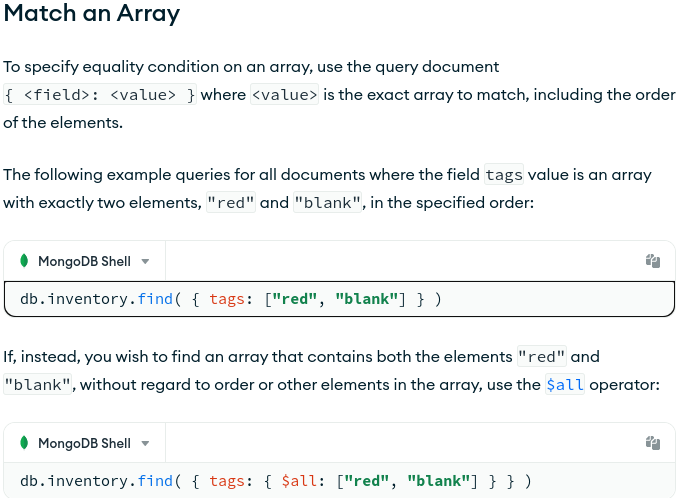

# mongodb_interview_preparation

## Theorical Questions Section

### Theorical Question 1

Do you know what is mongo Atlas ?

<b>Answer</b>

MongoDB Atlas is an integrated suite of data services centered around a cloud database designed to accelerate and simplify how you build with data.

Run anywhere in the world with Atlas. Deploy a database in over 90 regions on AWS, Azure, and Google Cloud - and expand to be global, multi-region, or multi-cloud when you need it. 

<b>Source</b>

https://www.mongodb.com/atlas/database

### Theorical Question 2

Do you know what Long-Running Snapshot Queries are ?

<b>Answer</b>

Snapshot queries allow you to read data as it appeared at a single point in time in the recent past.

Starting in MongoDB 5.0, you can use read concern "snapshot" to query data on secondary nodes. This feature increases the versatility and resilience of your application's reads. You do not need to create a static copy of your data, move it out into a separate system, and manually isolate these long-running queries from interfering with your operational workload. Instead, you can perform long-running queries against a live, transactional database while reading from a consistent state of the data.

Using read concern "snapshot" on secondary nodes does not impact your application's write workload. Only application reads benefit from long-running queries being isolated to secondaries.

<b>Source</b>

https://www.mongodb.com/docs/manual/tutorial/long-running-queries/

### Theorical Question 3

when would we use ordered list of operations vs unordered list of operations ?

<b>Answer</b>

With an ordered list of operations, MongoDB executes the operations serially. If an error occurs during the processing of one of the write operations, MongoDB will return without processing any remaining write operations in the list. See ordered Bulk Write

With an unordered list of operations, MongoDB can execute the operations in parallel, but this behavior is not guaranteed. If an error occurs during the processing of one of the write operations, MongoDB will continue to process remaining write operations in the list. See Unordered Bulk Write Example.

Executing an ordered list of operations on a sharded collection will generally be slower than executing an unordered list since with an ordered list, each operation must wait for the previous operation to finish.

By default, bulkWrite() performs ordered operations. To specify unordered write operations, set ordered : false in the options document.

<b>Source</b>

https://www.mongodb.com/docs/manual/core/bulk-write-operations/

### Theorical Question 4

what is Avoid Monotonic Throttling and how could you avoid it ?

<b>Answer</b>

If your shard key increases monotonically during an insert, then all inserted data goes to the last chunk in the collection, which will always end up on a single shard. Therefore, the insert capacity of the cluster will never exceed the insert capacity of that single shard.

If your insert volume is larger than what a single shard can process, and if you cannot avoid a monotonically increasing shard key, then consider the following modifications to your application:

Reverse the binary bits of the shard key. This preserves the information and avoids correlating insertion order with increasing sequence of values.

Swap the first and last 16-bit words to "shuffle" the inserts.

<b>Source</b>

https://www.mongodb.com/docs/manual/core/bulk-write-operations/

### Theorical Question 5

Do you know what this query is doing ?

db.inventory.find( { "size.h": { $lt: 15 } } )

<b>Answer</b>

In the collection inventory, inside of the size json, it is looking for the values of the key h where the value is less than 15

<b>Source</b>

https://www.mongodb.com/docs/manual/tutorial/query-embedded-documents/#specify-match-using-query-operator

### Theorical Question 6

Do you know what these queries are doing ?

db.inventory.find( { tags: ["red", "blank"] } )

db.inventory.find( { tags: { $all: ["red", "blank"] } } )

<b>Answer</b>

<b>Source</b>

https://www.mongodb.com/docs/manual/tutorial/query-embedded-documents/#specify-match-using-query-operator

### Theorical Question 7

How would you query an array of multiple embedded documents ?

<b>Answer</b>

https://www.mongodb.com/docs/manual/tutorial/query-array-of-documents/

<b>Source</b>

https://www.mongodb.com/docs/manual/tutorial/query-array-of-documents/

### Theorical Question 8

How would you execute the equivalent of this in mongoDB ?

SELECT _id, item, status from inventory WHERE status = "A"

<b>Answer</b>

https://www.mongodb.com/docs/manual/tutorial/project-fields-from-query-results/

<b>Source</b>

https://www.mongodb.com/docs/manual/tutorial/project-fields-from-query-results/

### Theorical Question 9

How to enable Retryable Writes

<b>Answer</b>

https://www.mongodb.com/docs/manual/core/retryable-writes/

<b>Source</b>

https://www.mongodb.com/docs/manual/core/retryable-writes/

